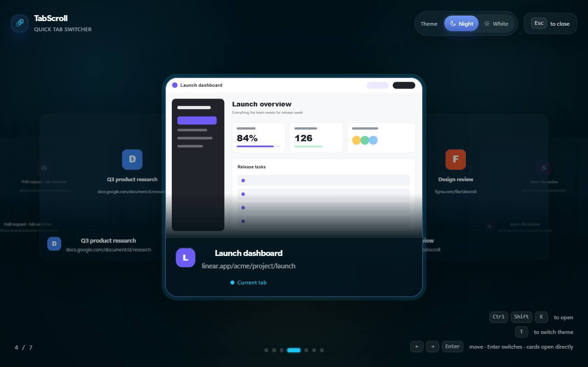

# TabScroll — Visual Alt-Tab for Chrome

TabScroll turns a crowded Chrome window into a full-screen visual tab switcher. Open it with `Ctrl+Shift+K` (`Command+Shift+K` on macOS), move with the mouse wheel or arrow keys, and press `Enter` to switch.



## Why TabScroll

- Recognize tabs from titles, site addresses, favicons, and a preview of the current page.
- Navigate without hunting through tiny tab-strip icons.
- Use the mouse wheel, arrow keys, click, or keyboard shortcut.
- Choose a light or night interface.
- Keep browsing data local: no account, analytics, advertising, or telemetry.

## Install

- [Install from the Chrome Web Store](https://chromewebstore.google.com/detail/tabscroll/monkhocbkbpjikgjkiaglgdannfmmmfd)
- For local development, open `chrome://extensions`, enable **Developer mode**, choose **Load unpacked**, and select the `extension/` directory.

Create a Chrome Web Store upload ZIP with:

```bash
bash extension/scripts/package-extension.sh
```

## How it works

1. Open TabScroll from the toolbar or press `Ctrl+Shift+K`.
2. Scroll or use the arrow keys to move through the current window's tabs.
3. Press `Enter` to activate the centered card, or click any visible card to switch directly.
4. Press `Esc` to close TabScroll.

## Permissions and privacy

TabScroll requires `activeTab` and `scripting` only after you explicitly open it. On first use, it explains an optional `tabs` permission that adds titles, site addresses, and favicons for all open tabs. You can decline and keep using a limited view.

TabScroll does not request debugger access or capture background-tab screenshots. Open-tab details and the current-tab preview stay in the browser. See the [privacy policy](extension/PRIVACY.md) and [technical permission details](extension/README.md).

## Marketing and release material

- [Chrome Web Store copy](marketing/STORE_LISTING.md)
- [Launch posts and short-video scripts](marketing/POSTS.md)
- [14-day launch plan](marketing/LAUNCH_PLAN.md)
- [Store screenshot source and exports](marketing/store-assets/)

## Project structure

```text
extension/   Chrome extension source
docs/        GitHub Pages landing page
marketing/   Store listing, launch copy, and promotional assets
```
